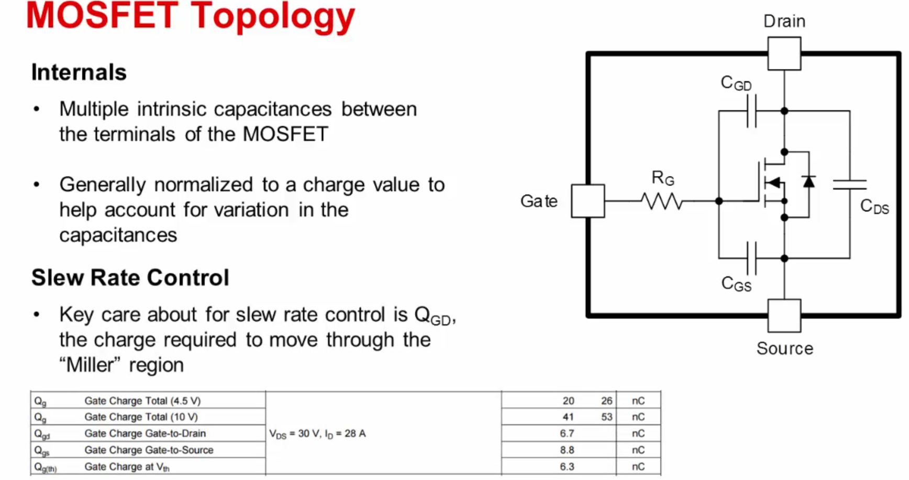
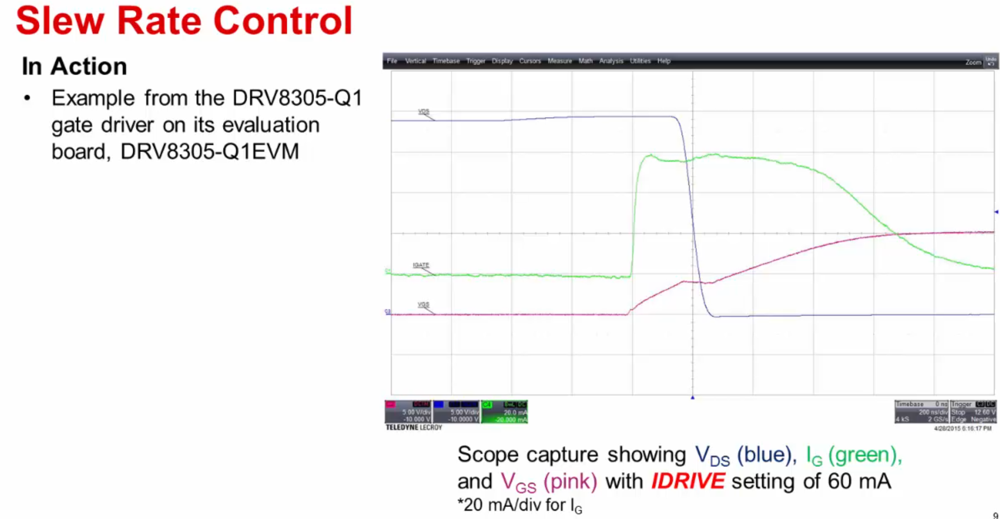
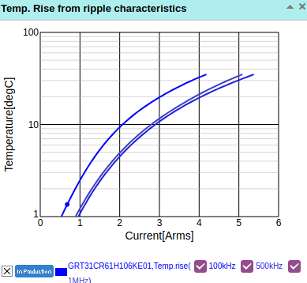

## Slew-rate Control
[From texas instruments](https://training.ti.com/smart-motor-gate-drive-series-mosfet-slew-rate-control)

Slew-rate means the slope of the VDS for the mosfet

## Driver for mosfet control

### Capacitors
**R3** based on (val wasnt mentioned)`8.3.1.2.1 Serial Peropheral Interface`  
**R4** based on Figure 34 (val wasnt mentioned)   
**C6** (X5R or X7R, 1-μF, 16-V ceramic capacitor) and **C5** (X5R or X7R, 47-nF, VM-rated ceramic capacitor) based on `8.3.1.3 Gate Driver Voltage  Supplies`   
**C6** suggested to be split in two CVM1(X5R or X7R, 0.1-μF, VM-rated capacitor) and CVM2 (≥ 10 μF, VM-rated capacitor)in `8.3. Feature description`   
**C6**  (A 0.1-μF ceramiccapacitorratedfor VM mustbe placedas closeto the deviceas possible) `10  PowerSupplyRecommendations`
**C7** (X5R or X7R, 1-μF, 6.3-V ceramic capacitor routed directly back to the adjacent AGND ground pin) according to `8.3.2 DVDD Linear Voltage Regulator`   
**VREFCAP** (X5R or X7R, 0.1-μF, VREF-rated capacitor) in `8.3. Feature description`    
**nSHDN** (suggested to be attached with the 100kOhm resistor to protect the device in case of larger input voltage) but in the design left floating from `8.3.4EnableSHDNand VIN UndervoltageLockout` from the `LMR16006` datasheet
**C17** and **C2** not clear how it was chosen (X5R or X7R, 1 to 10 μF, VM-rated capacitor suggested) from `8.3. Feature description`  

### Buck-boost
**Elements for Buck-Boost** configuration can be seen in `9.2 TypicalApplication` from `LMR16006` datasheet
If calculated with 0.6 max current and 40% K_id and max voltage 24V, the inductor minimum value should be bigger - **23.8uH**
Output capacitance is likely ok, only minimum value can be calculated, but the datasheet sugests to experiment with values up to **100uF** as stated in `9.2.2.3 Output Capacitor Selection`
Regarding input capacitance. If 10uF is chosen (suggested is value between 1uF and 10uF). Then the ripple current calculated is 0.25A and the input voltage deviation is 21mV. Capacitor ripple current must be greater then calculated. Based on the datasheet for 10uF capacitor from original design, the only concern is rise of the temperature when working in AC conditions, and based on the Temperature-Arms graph 0.25A is well inside the safe limit for this capacitor.

Resistors are taken from typical application and the output is fixed based on the resistance values(doesnt scale depending on input). How to calculate resistors is explained in `8.3.3 Output Voltage Setting`

## 3.3 V linear generator
**MC1** according to suggestion from `LDFM33PUR datasheet`
**C19** and **C20** (both 22 uF) not according to Stable ESR zone, in `LDFM33PUR datasheet` stated max value 22uF in `Figure 26: Stability plane 3.3 V (COUT, ESR)` 