# STM32F446re hardware design choices

Example from Nucle64 Development board design from STM:  
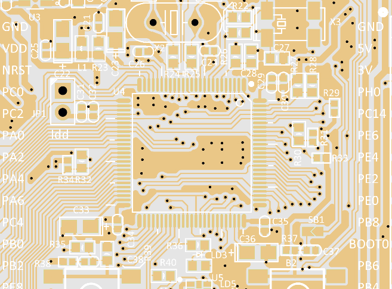

Another Example from STM32 series Evaluation board (Two capacitors for decoupling smaller C21 and the One which is selected with white outline):
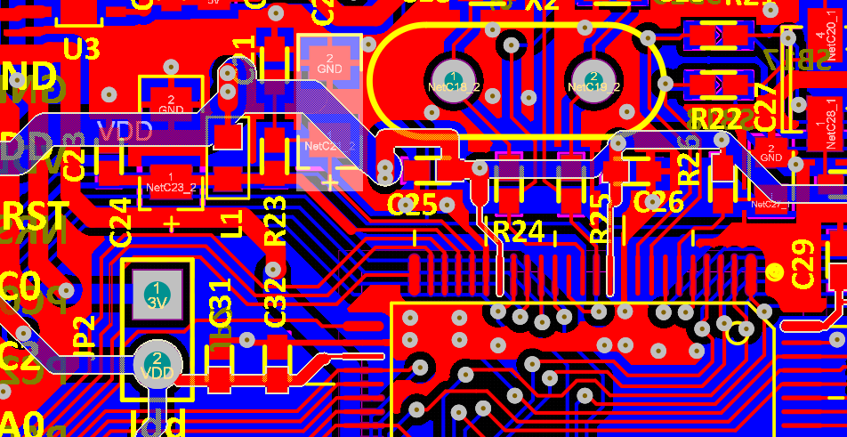  
In these schematics the closer is the bigger capacitor, however, that doesn't make much difference since both of them are not that close to the board. Recommendation is to place the smallest one as close as possible to the PCB as suggested by [Analog application note](https://www.analog.com/media/en/training-seminars/tutorials/MT-101.pdf) 

## Chosing murrata oscillator

Typical circuit diagram is presented in [CERALOCK Application Manual](https://www.murata.com/-/media/webrenewal/support/library/catalog/products/timingdevice/ceralock/p17e.ashx?la=en-gb&cvid=20210217041637000000):
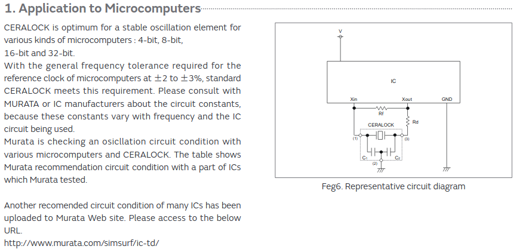

As stated, one can check [Murrata ICs Database](http://www.murata.com/simsurf/ic-td/) for more precise details on applications. For example, for `STM32F446` the following is shown:

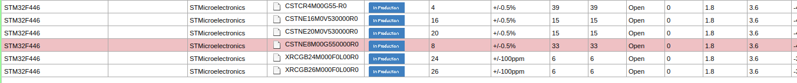

However, based on the datasheet of `STM32F446` in section `High-speed external clock generated from a crystal/ceramic resonator` the required precision is `500ppm`, which means that the maximum deviation is 0.05%. The oscillator from previous design `CSTNE8M00GH5L000R0` has precision of `0.07%(max)` which doesnt satisfy requirements, but seams that STM is working alright with this one aswell. 

**Important notice**: The pins of the oscillator in case of  `CSTNE8M00GH5L000R0` are not interchangable, which is stated in its datasheet. 

## EMI protection for power

[Explanation about how Ferrite Bead work](https://www.powersystemsdesign.com/articles/ferrite-bead-demystified/95/10031)
Ferrit Bead is suggested in Application note `AN4488-Getting started with stm32f4` in Chapter `7. Reference Design` and taken characteristics for suggested one: 

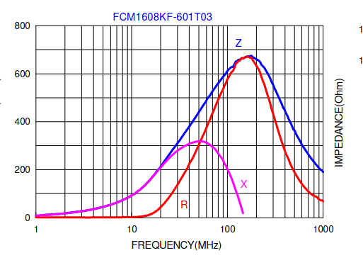

The one chosen in the design fits perfectly for this purpose. 

## Capacitors for power
In STM32 datasheet in General PCB design guidelines it is suggested to use parallel capacitors between VSSA and VDDA. 

[How to read STM32 Microcontroller Power Schematic](https://electronics.stackexchange.com/questions/325881/how-to-read-stm32f407xx-microcontroller-power-schematic) can further clarfy application note about how to use capacitors. 

Double capacitor for VBAT pin is used (for other 3v3 pins only single 100nF capacitor is used):
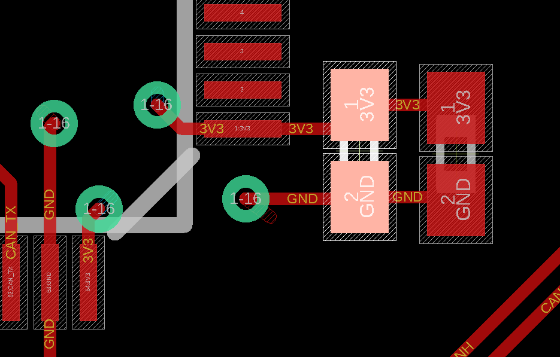

Capacitors for VDDs are suggested as 100nF from Power supply scheme in Datasheet.

### Capacitors insights

Suggested value is just 100nF instead of 2 parallel with different values because of the anti-resonance effect. Check [Capacitors vs frequency, ringing, ESL, ESR](https://electronics.stackexchange.com/questions/327975/capacitance-vs-frequency-graph-of-ceramic-capacitors)

#### Insigts about the ESL and ESR of Capacitors from [Lecture](http://ntuemc.tw/upload/file/20120419205619a4fcf.pdf)
Higher capacitance -> Higher ESL (depends largly from packaging - same package -> same Inductance). Additional: Thats why when having parallel capacitors of different values the advantage if smaller value is that its available in smaller package, meaning with smaller ESL.  [Source](https://electronics.stackexchange.com/questions/327975/capacitance-vs-frequency-graph-of-ceramic-capacitors)
Higher capacitance -> Lower ESR (It depends from technology, the best one is `NFO`, and next best is `X7R`)

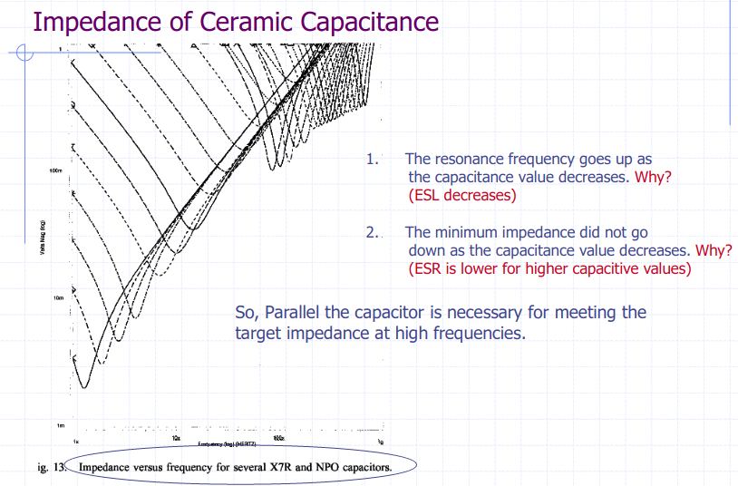

ESL of the capacitance depends on:  
- Pad layout (the biggest amoung all, can be reduced by proper pad design and via placement)
- Capacitor height
- Power plance spreading inductance

Pad layout design and via placing:
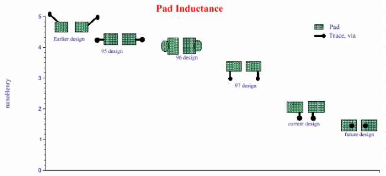

Plane separation influence: 
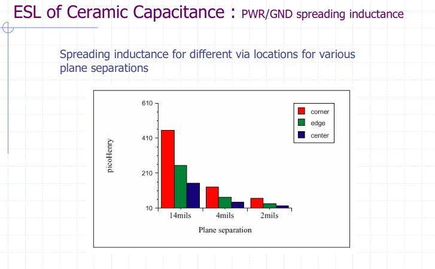
#### Same value capacitors 
Same value capacitance will reduce overall impedance: 
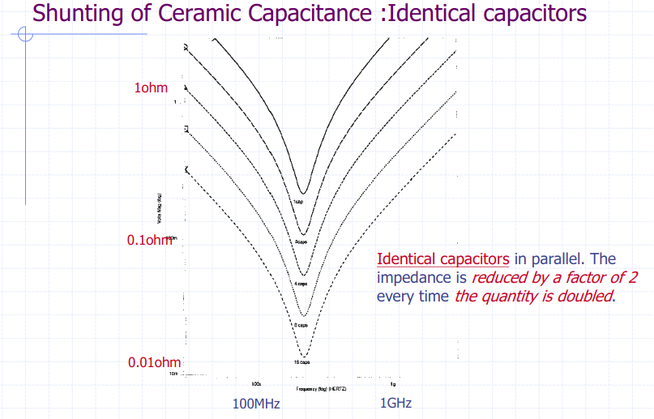
#### Anti-resonance for different values capacitors
Problem (especially when large gaps exist in capacitive values)
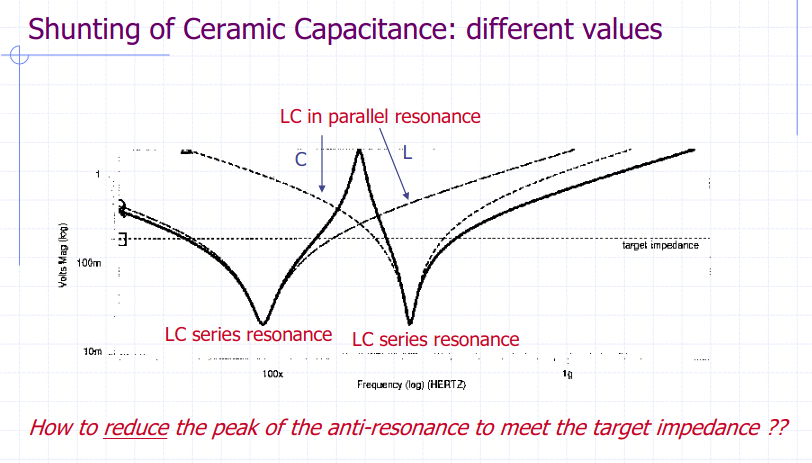
Solution is to minimise the ESL
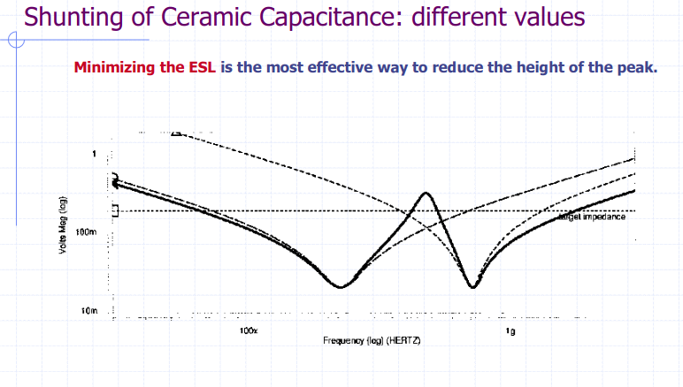

#### Capacitors value can vary as mentioned [here](https://electronics.stackexchange.com/a/288899/221561)
With temeparture and time, capacitor values can change up to 40% of its rated voltage. 

Thumb up rule would be to use on max the half of their rated voltage, also the value of capacitor can be increased up to 2 times, since for regulator decopling, the value is often important for stability. 

## VCAP_1 external capacitor
In STM32 datasheet it is suggested to use 4.7uF when single VCAP pin is present. 

## CAN interface
Pins PB8 and PB9 are used for CAN1. Pins PB7 and PB6 not clear
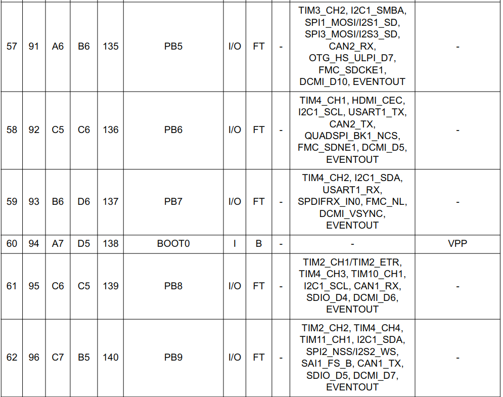

## Debug
2 debug pins are provided PA13 and PA14 which are used for SW debug (support for JTAG not provided)

## Other notes
General guideliness and for example schematic check `Getting started with STM32F4xxxx MCU hardware development AN4488`

# CAN interface 
As presented on example in `1.8Typical Applications` in `U$6-MCP2542` Datasheet

# 3.3 V linear generator
**MC1** according to suggestion from `LDFM33PUR datasheet`
**C19** and **C20** (both 22 uF) not according to Stable ESR zone, in `LDFM33PUR datasheet` stated max value 22uF in `Figure 26: Stability plane 3.3 V (COUT, ESR)`. However, due to the constant bias voltage acting on capacitors (3.3V) the capacitance will be reduced by more then 50%; yealding in total for two capacitors a bit less then 22uF under 3.3V and 25 Degrees Celsius. For more precise estimation of the capacitance refer to  [Samsung Product Database](http://product.samsungsem.com/mlcc/basic-search.do), or [Murrata Product Database SimuSurfing](https://ds.murata.co.jp/simsurfing/index.html?lcid=en-us)

# Switch
[Suggestion for the button switch](https://www.digikey.de/product-detail/de/e-switch/TL3305AF160QG/EG5350TR-ND/5816181)
[Top switch](https://www.digikey.de/product-detail/de/e-switch/TL3302AF180QG/EG2528DKR-ND/745644)
[Side switch](https://www.digikey.de/product-detail/de/TL1014BF160QG/EG5042CT-ND/3910808/?itemSeq=360831777)