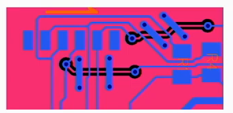
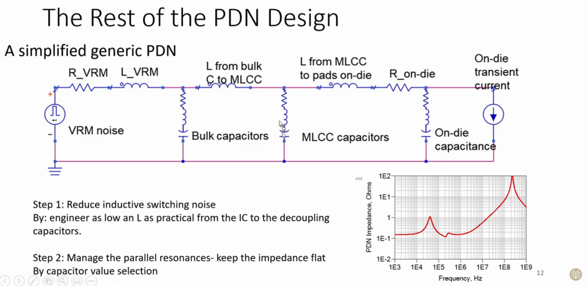
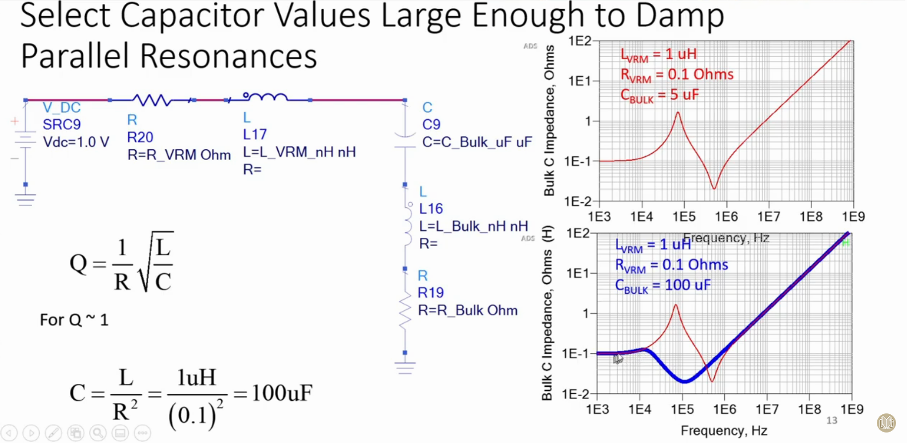
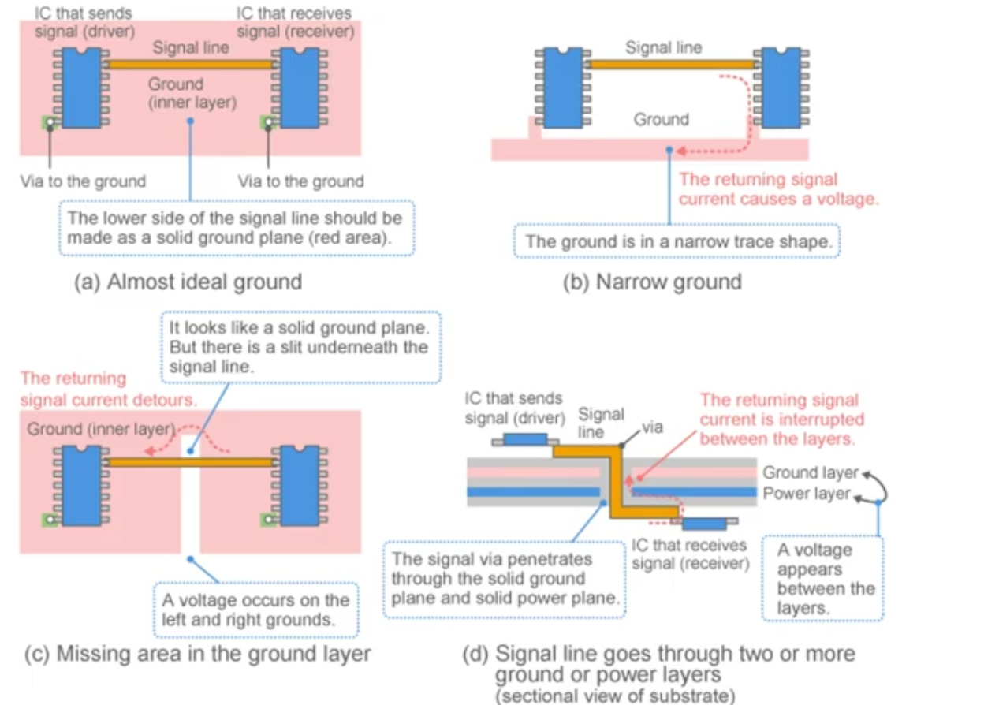
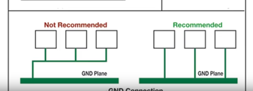
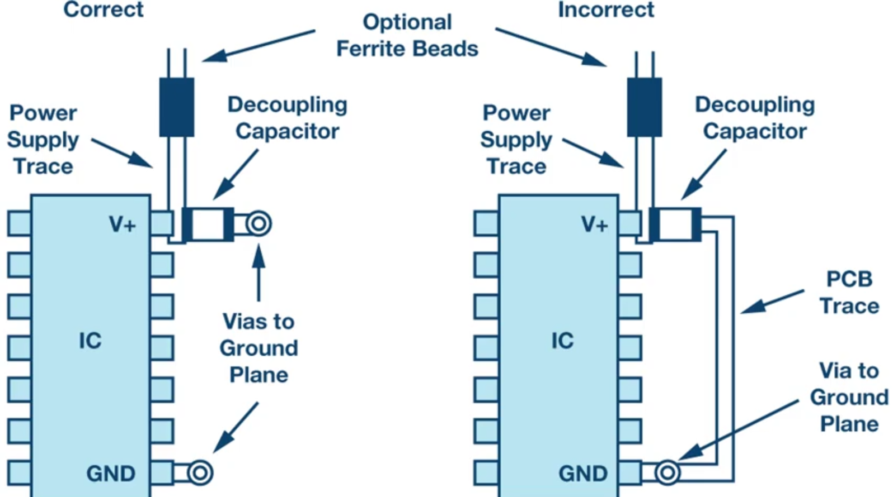
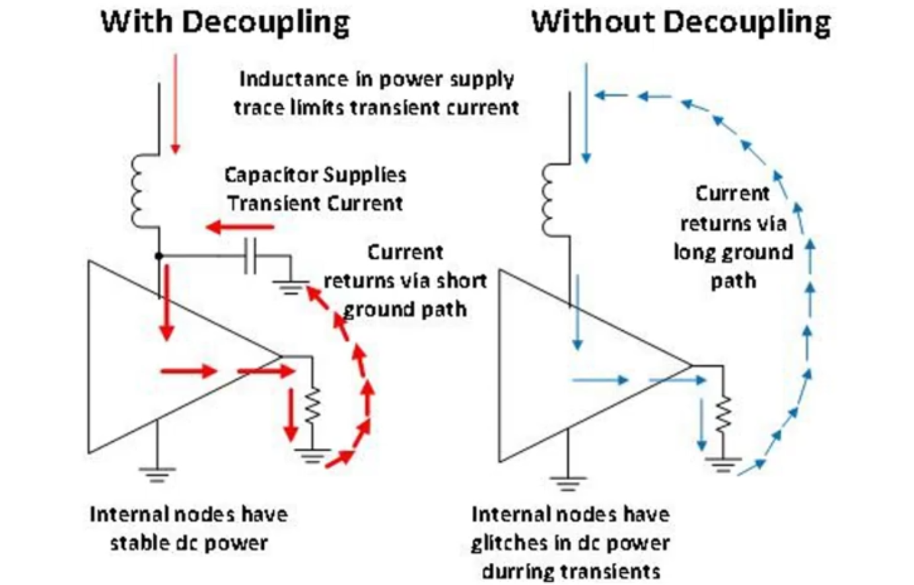
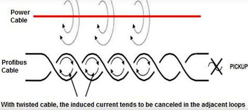

[Suggestions on placing the MOSFETs to prevent ringing](https://www.ti.com/lit/an/slpa005/slpa005.pdf?ts=1617219980194)
[LT Spice circuit simulation for begginers](http://electronicsbeliever.com/ltspice-circuit-simulation-tutorials-for-beginners/)

## General guideliness
Based on the [Eric Bogatin on Breaking Bad Habits in PCB Design](https://www.youtube.com/watch?v=DIMIzKRmync).Some additional details in his [article](https://www.signalintegrityjournal.com/blogs/12-fundamentals/post/1207-seven-habits-of-successful-2-layer-board-designers)
Signal trace width - 6 mil (1 Amp max)
Power traces - 20 mil (3 Amp max)
Drilled diameter for signal traces - 13 mil - narrow via to get higher interconnectency
If one must route something on bottom layer, make path short and use bridges (return strap) as on the picture:

[Algorighm for choosing the capacitance](https://youtu.be/y4REmZlE7Jg) is to flat out the previous circuit impedance (as looking from the end- Microcontroller for example) to the beggingin (Voltage source)

In particular, when chosing capcitance, try to flat out the peak from the previous capacitance in the circuit: 

Initial resons for having several capacitance: 
1. Smaller value would have lower inductance (to lower down impedance on higher frequences)
2. Larger values will provide needed capacitance for the device

**Some useful guideliness from [YouTube](https://www.youtube.com/watch?v=YMfBbiguoY4)**  
Careful about the return paths: 

For more information on return paths check [Understanding return paths](https://www.emcs.org/acstrial/newsletters/fall08/tips.pdf)  

Suggestion on ground connection:  
  
Watch out traces:    
  

Paths when decopling introduced:  
  

Reason behind twisting the power cables:  
  

Thermal via size is important- if too large, termal vias will wick the solder material which can result in poor connection of the termal pad to the package. Based on [Texas instruments application note](https://www.ti.com/lit/an/slma002h/slma002h.pdf?ts=1618675811337&ref_url=https%253A%252F%252Fwww.google.com%252F) it is suggested to use 0.33mm drill size via, or smaller (with copper plated barrell for conductivity)
